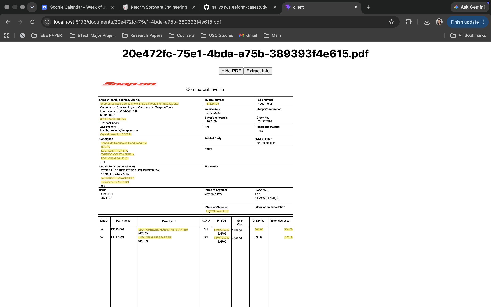
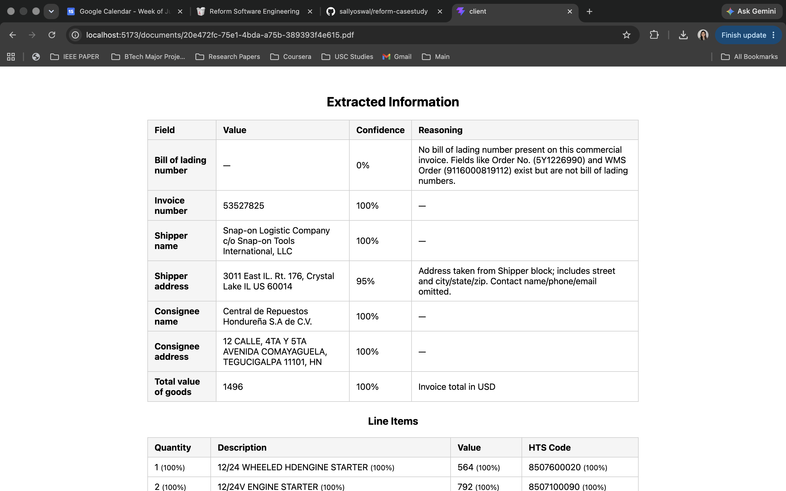

# reform-casestudy

Upload a shipping PDF (bill of lading, invoice), view it, and extract structured fields via Claude — with extracted values highlighted on the PDF.

| PDF viewer with extracted values highlighted | Extracted field table with confidence + reasoning |
| --- | --- |
|  |  |

## Steps to start the services

Prerequisites: Node 18+, npm.

```sh
npm install
cp server/.env.example server/.env   # set ANTHROPIC_API_KEY
cp client/.env.example client/.env
npm run dev
```

- Client: http://localhost:5173
- Server: http://localhost:4001

Build: `npm run build`

## Design

- **npm workspaces monorepo**: `client/` (React + Vite + TS), `server/` (Express + TS).
- **API**: `/api/health`, `/api/upload` (multer, UUID filenames, MIME-validated), `/api/extract/:filename` (sends the PDF natively to `claude-opus-4-8`, uses structured outputs to guarantee schema-valid JSON).
- **Per-field confidence/reasoning**: each extracted field is `{ value, confidence, reasoning }` instead of one overall score, so the UI can flag exactly which fields are uncertain and explain substitutions (e.g. "sender address" used for `shipper_address`).
- **PDF viewer**: `react-pdf` instead of an `<iframe>`, since it exposes a real text layer — required to highlight extracted values on the rendered PDF. PDF is passed as a `Blob` (not `Uint8Array`) to avoid a pdf.js/StrictMode ArrayBuffer-detach bug.
- **Client routing**: `UploadPage` → `/documents/:filename` → `DocumentPage` (view/extract).

## Assumptions

- Single-user/local tool — no auth, no per-user file isolation.
- One shipment per PDF (one shipper/consignee/line-item set).
- Confidence/reasoning are the model's self-assessment, not independently verified.
- Uploaded files persist indefinitely on local disk, no cleanup job.
- Highlighting is substring-match against pdf.js text spans, not exact OCR alignment.

## Improvements

- Automated tests (routes + UI flow) — none yet.
- Precise highlighting via pdf.js text bounding boxes instead of substring matching.
- Auth + object storage instead of local disk.
- Accuracy validation against a labeled document set.
- Progress/cancel UI for slower extractions.
- Visual styling (deferred throughout this build).
- File expiry/cleanup, fail-fast env var validation.
